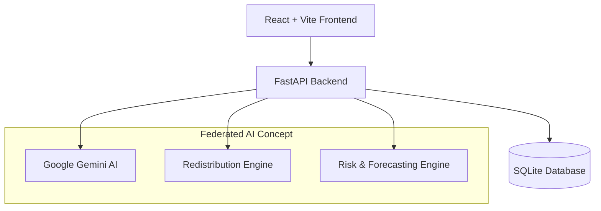

# SwasthyaSetu

> **"Predict shortages. Move resources. Protect communities."**

SwasthyaSetu is a health supply-chain resilience platform for India's Primary Health Centres (PHCs). It provides a federated, real-time view of healthcare resources and uses data algorithms to predict shortages before they occur and intelligently recommend resource redistribution across the network.

## 🚀 Features

- **Executive Dashboard:** Real-time visibility into the health of the entire network.
- **Predictive Forecasting:** Anticipates medicine shortages using historical consumption data and demand trends.
- **Intelligent Redistribution Engine:** Automatically identifies nearby PHCs with surplus inventory and recommends optimal transfers based on distance and urgency.
- **Network Health Map:** A dynamic geographical view of all PHCs and their current status (Healthy, Warning, Critical).

- **Real-time Simulation Engine:** For presentation purposes, the dashboard simulates real-time consumption and dynamic stock updates.

## 🛠️ Architecture



## Local Setup & Installation

### 1. Backend Setup (FastAPI & SQLite)
Open a terminal in the `backend/` directory and run:
```bash
# Create a virtual environment and activate it
python -m venv venv
# On Windows: .\venv\Scripts\activate
# On Mac/Linux: source venv/bin/activate

# Install dependencies
pip install -r requirements.txt

# Run the seed script to generate mock PHC and supply chain data
python seed.py

# Start the backend server
uvicorn main:app --host 0.0.0.0 --port 8000
```
The backend will be running at `http://localhost:8000`.

### 2. Frontend Setup (React & Vite)
Open a new terminal in the `frontend/` directory and run:
```bash
# Install Node dependencies
npm install

# Start the Vite development server
npm run dev
```
The frontend will be running at `http://localhost:5173`.

## 🏗️ Tech Stack

- **Frontend:** React, TypeScript, Vite, Tailwind CSS, Recharts (Charts), React-Leaflet (Maps), Lucide (Icons).
- **Backend:** Python, FastAPI, SQLAlchemy.
- **Database:** SQLite (Used for the prototype to avoid complex setup, easily switchable to PostgreSQL via SQLAlchemy).
- **AI/ML:** Google Gemini API (Fallback mock-mode available for offline presentations).

## 🚦 Getting Started

### 1. Backend Setup

```bash
cd backend
python -m venv venv

# Windows
.\venv\Scripts\activate
# Mac/Linux
source venv/bin/activate

pip install -r requirements.txt

# (Optional) Set your Gemini API Key in .env or environment variable
# export GEMINI_API_KEY="your_api_key_here"

# Start the server (will automatically seed the database on first run)
uvicorn main:app --reload --host 0.0.0.0 --port 8000
```

### 2. Frontend Setup

```bash
cd frontend
npm install
npm run dev
```

The application will be available at `http://localhost:5173/`.

## 🎤 Demo Scenario Instructions

1. **Start at the Dashboard:** Open the main Overview page. Observe the KPIs and "Network Health Story".
2. **Trigger Simulation:** Click the "Simulate Time Step" button on the top right. Watch the numbers dynamically update as synthetic consumption occurs across the state.
3. **Analyze Network:** Navigate to the "PHC Network" tab. View the geographic clustering of "Critical" vs "Healthy" PHCs.
4. **Predictive Forecasting:** Navigate to "Forecasting". Show how the AI predicts future demand trends and identifies stock-out dates before they reach zero.
5. **Redistribution:** Navigate to the "Redistribution" tab. The system will automatically suggest transfers (e.g., *Transfer 400 units from PHC B to PHC A*). Explain the AI logic behind the selection (distance, surplus, urgency).
6. **AI Insights:** Go to "AI Insights" and ask the chatbot a natural language question (e.g., "Why is Paracetamol demand increasing?").

## 🔒 Security & Privacy (Federated Learning Concept)

While this is a prototype, the architecture is designed around the concept of **Federated Health Intelligence**. 
Raw patient and PHC-level sensitive data does not need to leave the state/local system. Only model updates and aggregated insights are shared to the National level, preserving privacy while enabling national resilience.
