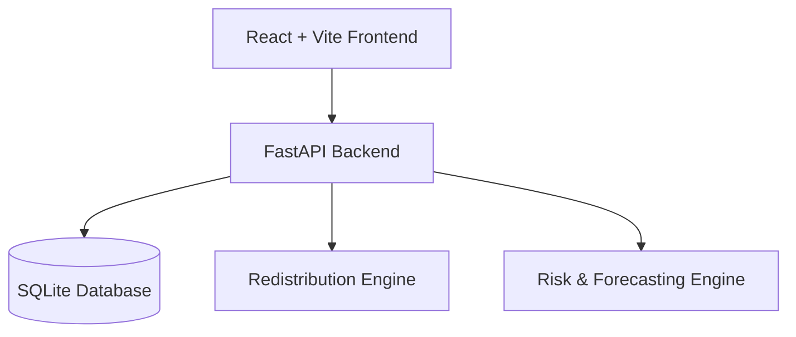

# SwasthyaSetu

> **"Predict shortages. Move resources. Protect communities."**

SwasthyaSetu is a health supply-chain resilience platform for India's Primary Health Centres (PHCs). It provides a federated, real-time view of healthcare resources and uses data algorithms to predict shortages before they occur and intelligently recommend resource redistribution across the network.

## 🚀 Features

- **Executive Dashboard:** Real-time visibility into the health of the entire network.
- **Predictive Forecasting:** Anticipates medicine shortages using historical consumption data and demand trends.
- **Intelligent Redistribution Engine:** Automatically identifies nearby PHCs with surplus inventory and recommends optimal transfers based on distance and urgency.
- **Network Health Map:** A dynamic geographical view of all PHCs and their current status (Healthy, Warning, Critical).

- **Real-time Simulation Engine:** For presentation purposes, the dashboard simulates real-time consumption and dynamic stock updates.

## 🛠️ Architecture



## 🚦 Step-by-Step Setup Guide

Follow these steps to run the SwasthyaSetu prototype locally on your machine.

### Step 1: Clone the Repository
Open your terminal and clone the repository (or fork it first and clone your fork):
```bash
git clone https://github.com/adityayadav-dev/SwasthyaSetu-AI.git
cd SwasthyaSetu-AI
```

### Step 2: Backend Setup (FastAPI & SQLite)
The backend uses Python and FastAPI. It uses a local SQLite database for easy setup.
```bash
# Navigate to the backend directory
cd backend

# Create a virtual environment
python -m venv venv

# Activate the virtual environment
# On Windows:
.\venv\Scripts\activate
# On Mac/Linux:
source venv/bin/activate

# Install all required Python dependencies
pip install -r requirements.txt

# Run the database seeder to populate mock PHC and supply chain data
python seed.py

# Start the backend API server
uvicorn main:app --host 0.0.0.0 --port 8000
```
*The backend is now running at `http://localhost:8000`.*

### Step 3: Frontend Setup (React & Vite)
Open a **new, separate terminal window**, leaving the backend running in the first one.
```bash
# Navigate to the frontend directory
cd frontend

# Install Node dependencies
npm install

# Start the Vite development server
npm run dev
```
*The frontend is now running at `http://localhost:5173`.*

## 🏗️ Tech Stack

- **Frontend:** React, TypeScript, Vite, Tailwind CSS, Recharts (Charts), React-Leaflet (Maps), Lucide (Icons).
- **Backend:** Python, FastAPI, SQLAlchemy.
- **Database:** SQLite (Used for the prototype to avoid complex setup, easily switchable to PostgreSQL).

## 🎤 Detailed Demo Instructions

Use this script to present SwasthyaSetu effectively during a demo or pitch:

1. **The Command Center (Overview Dashboard)**
   - Open `http://localhost:5173/`
   - Point out the real-time KPI cards (Total PHCs, Critical Shortages, Available Beds).
   - Click the **"Simulate Time Step"** button on the top right. Explain that this simulates real-time consumption and supply-chain events happening across the state. Watch the numbers dynamically update.
2. **Network Health & Live Inventory**
   - Navigate to the **Inventory** tab.
   - Show how the platform actively calculates `days_remaining` based on localized consumption rates, instantly flagging critical shortages with red badges before stock reaches zero.
3. **Algorithmic Forecasting**
   - Navigate to **Forecasting**.
   - Select a PHC and Medicine.
   - Explain that the system plots 30 days of actual historical consumption data from the database and projects a 14-day trendline. 
   - Point out the Insight Summary panel that alerts you of incoming stockouts.
4. **Intelligent Redistribution (Prescriptive Analytics)**
   - Navigate to the **Redistribution** tab. 
   - Explain that when a shortage is predicted, the system automatically scans nearby facilities and suggests the optimal transfer (e.g., *Transfer 400 units from PHC B to PHC A*), balancing physical distance with available surplus.
   - Click **"Approve Transfer"** to demonstrate how an administrator actions these insights.
5. **Dynamic Emergency Alerts**
   - Click the **Notification Bell** icon in the top right.
   - Explain that the system constantly monitors inventory, staffing levels, and bed occupancy, pushing critical alerts directly to administrators when intervention is required.

## 🔒 Security & Privacy (Federated Learning Concept)

While this is a prototype, the architecture is designed around the concept of **Federated Health Intelligence**. 
Raw patient and PHC-level sensitive data does not need to leave the state/local system. Only aggregated insights are shared to the National level, preserving privacy while enabling national resilience.
